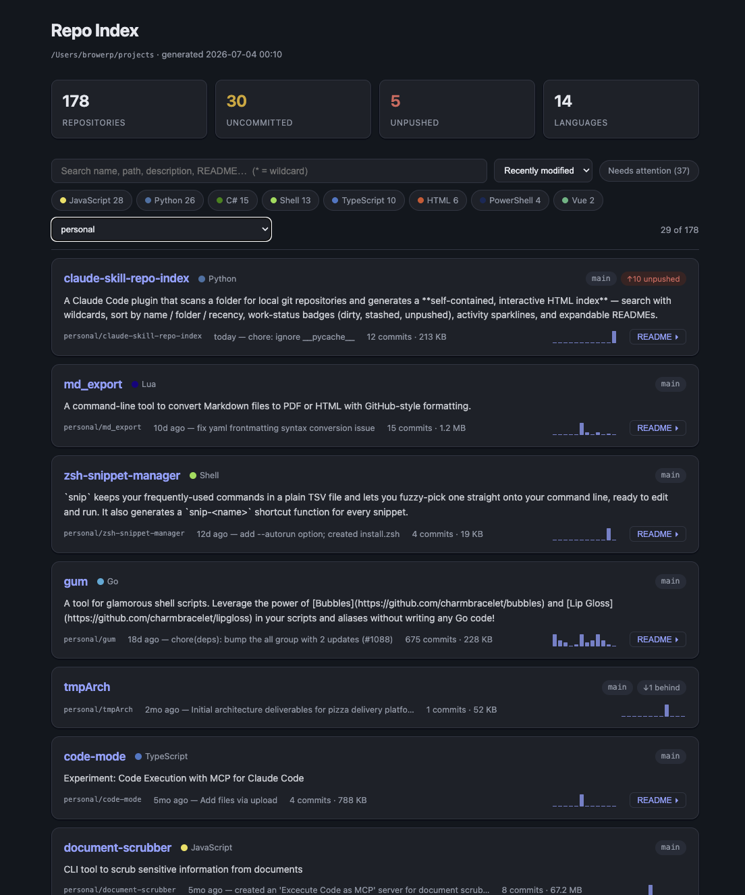

# claude-repo-index

A Claude Code plugin that scans a folder for local git repositories and generates
a **self-contained, interactive HTML index** — search with wildcards, sort by
name / folder / recency, work-status badges (dirty, stashed, unpushed), activity
sparklines, and expandable READMEs.

Local-only: no network calls, no GitHub API, no `git fetch`. Works with private repos.



## Install

```
/plugin marketplace add lopperman/claude-repo-index
/plugin install repo-index@claude-repo-index
```

## Use

```
/repo-index ~/projects
```

Writes `repo-index.html` into the scanned folder and opens it in your browser.
Re-run any time to refresh it.

## What each repo card shows

- Name (linked to its remote when one exists), primary language, description
- Branch, uncommitted/stashed/unpushed/behind badges
- Last commit (date, message), commit count, size on disk
- 12-month commit sparkline
- Expandable full README

## Development

```
python3 tests/test_scan_repos.py   # stdlib-only test suite (builds throwaway git fixtures)
```
